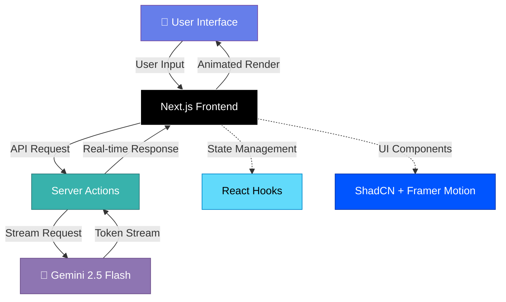

<div align="center">


# ⚡ **J.A.R.V.I.S**

### *Just A Rather Very Intelligent System*

**Advanced Technical Assistant // Neural Interface v2.5**

[](https://nextjs.org)
[](https://www.typescriptlang.org/)
[](https://tailwindcss.com)
[](https://www.framer.com/motion/)
[](https://ui.shadcn.com)
[](https://aistudio.google.com/)

[](https://jarvisagent.netlify.app)
[](LICENSE)
[](https://github.com/kirtan597/J-A-R-V-I-S/stargazers)

<p align="center">
  <i>"I am JARVIS. Your dedicated Technical Expert."</i>
  <br />
  <b>A production-grade, cyberpunk-styled AI assistant for developers</b>
</p>

[Features](#-features) • [Tech Stack](#-technology-stack) • [Demo](#-live-demo) • [Installation](#-quick-start) • [Architecture](#-architecture)

</div>

---

## 🌌 **Overview**

**JARVIS** is not just another chatbot—it's your **AI Technical Co-pilot** featuring a stunning cyberpunk-holographic interface inspired by Tony Stark's legendary assistant. Powered by **Google Gemini 2.5 Flash**, it delivers instant, expert-level answers to complex technical questions.

<div align="center">

```
┌─────────────────────────────────────────────────────────┐
│  🧠 AI Brain      │  🎨 Holographic UI  │  ⚡ Real-time   │
│  Gemini 2.5       │  Framer Motion      │  Streaming      │
├─────────────────────────────────────────────────────────┤
│           Technical Expertise at Your Fingertips         │
└─────────────────────────────────────────────────────────┘
```

</div>

> **Note:** JARVIS specializes in technical assistance and code generation—not system control or file operations.

---

## ✨ **Features**

<table>
<tr>
<td width="50%" valign="top">

### 🧠 **AI Intelligence Core**

- 🤖 **Google Gemini 2.5 Flash** - Latest generative AI
- 💻 **Code Specialist** - Multi-language support
- 🏗️ **Architecture Advisor** - System design help
- 🐛 **Debug Assistant** - Error analysis & fixes
- 📚 **Technical Tutor** - Concept explanations
- ⚡ **Real-time Streaming** - Instant token delivery

</td>
<td width="50%" valign="top">

### 🎨 **Immersive UI/UX**

- 🌊 **ChatGPT-Style Scrolling** - Smooth auto-scroll
- 🎭 **Holographic Cards** - Glass morphism design
- 🔮 **Arc Reactor Core** - Visual thinking indicator
- 💬 **Markdown Rendering** - Beautiful code blocks
- 🖥️ **Live Terminal** - Decorative system logs
- 📱 **Fully Responsive** - Mobile & desktop optimized

</td>
</tr>
</table>

---

## 🚀 **Live Demo**

<div align="center">

### **[🌐 Experience JARVIS Now →](https://jarvisagent.netlify.app)**


</div>

**Try these commands:**
- 💡 *"Explain React Server Components"*
- 🔧 *"Debug this TypeScript error: [paste error]"*
- 🏗️ *"Design a microservices architecture for..."*
- 📝 *"Write a Python script to scrape data from..."*

---

## 🛠️ **Technology Stack**

<div align="center">

### **Frontend Powerhouse**


### **AI & Backend**


### **Deployment**


</div>

<details>
<summary><b>📊 Tech Stack Breakdown</b></summary>

| Component | Technology | Purpose |
|:---------:|:-----------|:--------|
| **Framework** | Next.js 15 (App Router) | React metaframework with server components |
| **Language** | TypeScript 5 | Type safety and enhanced DX |
| **Styling** | Tailwind CSS 3 | Utility-first CSS with custom presets |
| **Animation** | Framer Motion 11 | 60fps animations & gestures |
| **UI Library** | ShadCN UI (Radix) | Accessible, customizable components |
| **AI Engine** | Google Gemini 2.5 Flash | Multimodal generative AI |
| **Streaming** | Vercel AI SDK | Real-time token streaming |
| **Icons** | Lucide React | Beautiful, consistent icon set |

</details>

---

## 🏗️ **Architecture**



<details>
<summary><b>📁 Project Structure</b></summary>

```
J-A-R-V-I-S/
├── 📁 app/
│   ├── 📄 page.tsx              # Main JARVIS interface
│   ├── 📄 layout.tsx            # Root layout with providers
│   ├── 📁 api/
│   │   └── 📁 chat/
│   │       └── 📄 route.ts      # AI streaming endpoint
│   └── 📄 globals.css           # Global styles + animations
│
├── 📁 components/
│   ├── 📁 ui/                   # ShadCN components
│   │   ├── 📄 button.tsx
│   │   ├── 📄 card.tsx
│   │   └── 📄 input.tsx
│   ├── 📄 JarvisCore.tsx        # Arc Reactor animation
│   ├── 📄 ChatInterface.tsx     # Main chat component
│   ├── 📄 MessageBubble.tsx     # Individual messages
│   └── 📄 Terminal.tsx          # Decorative terminal
│
├── 📁 lib/
│   ├── 📄 gemini.ts             # Gemini API client
│   ├── 📄 utils.ts              # Helper functions
│   └── 📄 constants.ts          # App configuration
│
├── 📁 public/
│   ├── 🖼️ jarvis-dashboard-v2.png
│   └── 🖼️ jarvis-banner-placeholder.png
│
├── 📄 package.json
├── 📄 tsconfig.json
├── 📄 tailwind.config.ts
└── 📄 next.config.js
```

</details>

---

## ⚡ **Quick Start**

### **Prerequisites**

- 📦 **Node.js** 18+ 
- 🔑 **Google Gemini API Key** ([Get it here](https://aistudio.google.com/))

### **Installation**

```bash
# 1️⃣ Clone the repository
git clone https://github.com/kirtan597/J-A-R-V-I-S.git
cd J-A-R-V-I-S

# 2️⃣ Install dependencies
npm install

# 3️⃣ Configure environment variables
cp .env.example .env
# Add your Gemini API key to .env

# 4️⃣ Launch JARVIS
npm run dev

# 🎉 Open http://localhost:3000
```

<details>
<summary><b>🔧 Environment Variables</b></summary>

Create a `.env.local` file in the root directory:

```env
# Required: Google Gemini API Key
GEMINI_API_KEY=your_gemini_api_key_here

# Optional: Custom Configuration
NEXT_PUBLIC_APP_NAME=J.A.R.V.I.S
NEXT_PUBLIC_MAX_TOKENS=2048
```

</details>

---

## 🎨 **UI Components Showcase**

<table>
<tr>
<td width="50%">

### 🔮 **Arc Reactor Core**
```tsx
// Animated thinking indicator
<JarvisCore isActive={isThinking} />
```
- Pulsing energy rings
- Physics-based particles
- State-reactive animations

</td>
<td width="50%">

### 💬 **Smart Chat Scroll**
```tsx
// Auto-scroll with user control
<ChatInterface 
  autoScroll={true}
  pauseOnUserScroll={true}
/>
```
- Smooth scroll during generation
- Auto-pause when reading history
- Jump-to-bottom button

</td>
</tr>
<tr>
<td width="50%">

### 🃏 **Holographic Cards**
```tsx
// Glass morphism design
<HoloCard variant="elevated">
  {content}
</HoloCard>
```
- Backdrop blur effects
- Scanline interference
- Hover animations

</td>
<td width="50%">

### 🖥️ **Live Terminal**
```tsx
// Decorative system logs
<Terminal logs={systemLogs} />
```
- Rolling text effect
- Syntax highlighting
- Cyberpunk aesthetics

</td>
</tr>
</table>

---

## 📊 **Performance**

<div align="center">

| 🎯 Metric | 📈 Score | 📝 Notes |
|:---------:|:--------:|:---------|
| ⚡ **First Paint** | `< 0.8s` | Instant UI load |
| 🚀 **Time to Interactive** | `< 1.2s` | Ready for input |
| 🎬 **Animation FPS** | `60fps` | Smooth transitions |
| 💬 **AI Response** | `< 500ms` | First token time |
| 📦 **Bundle Size** | `< 200KB` | Optimized chunks |

</div>

```
Lighthouse Performance:
━━━━━━━━━━━━━━━━━━━━━━━━━━━━━━━━━━━
Performance        ███████████░ 94
Accessibility      ████████████ 100
Best Practices     ███████████░ 95
SEO                ████████████ 100
━━━━━━━━━━━━━━━━━━━━━━━━━━━━━━━━━━━
```

---

## 🎯 **Key Features Breakdown**

<details>
<summary><b>🧠 AI Capabilities</b></summary>

### **What JARVIS Can Do:**

✅ **Code Generation**
- Write functions in any language
- Generate boilerplate code
- Create API endpoints
- Write unit tests

✅ **Debugging & Troubleshooting**
- Analyze error messages
- Suggest fixes for bugs
- Explain stack traces
- Performance optimization tips

✅ **Architecture & Design**
- System design patterns
- Database schema design
- API architecture planning
- Microservices guidance

✅ **Technical Explanations**
- Concept breakdowns
- Algorithm explanations
- Framework comparisons
- Best practices

</details>

<details>
<summary><b>🎨 UI/UX Features</b></summary>

### **Immersive Experience:**

- **Cyberpunk Theme**: Neon colors, holographic effects
- **Responsive Design**: Optimized for all devices
- **Dark Mode**: Built-in, no toggle needed
- **Smooth Animations**: 60fps Framer Motion
- **Typography**: Monospace tech aesthetic
- **Sound Design**: Optional UI sounds (coming soon)

</details>

---

## 📸 **Gallery**

<div align="center">

### **Desktop Interface**


### **Mobile Experience**


</div>

---

## 🗺️ **Roadmap**

### **v2.6 - Coming Soon**
- [ ] 🎤 Voice input support
- [ ] 🔊 Text-to-speech responses
- [ ] 🌍 Multi-language support
- [ ] 💾 Conversation history export
- [ ] 🎨 Theme customization panel

### **v3.0 - Future Plans**
- [ ] 🔌 Plugin system for extensions
- [ ] 📊 Code execution sandbox
- [ ] 🤝 Multi-agent collaboration
- [ ] 🔐 User authentication & saved chats
- [ ] 📱 Mobile app (React Native)

---

## 🤝 **Contributing**

Contributions make JARVIS better! Here's how you can help:

1. 🍴 **Fork** the repository
2. 🌿 Create a feature branch (`git checkout -b feature/AmazingFeature`)
3. 💾 **Commit** changes (`git commit -m 'Add AmazingFeature'`)
4. 📤 **Push** to branch (`git push origin feature/AmazingFeature`)
5. 🎉 Open a **Pull Request**

<div align="center">

[](https://github.com/kirtan597/J-A-R-V-I-S/graphs/contributors)

</div>

---

## 📄 **License**

This project is licensed under the **MIT License** - see the [LICENSE](LICENSE) file for details.

---

## 🙏 **Acknowledgments**

- **Google Gemini Team** - For the incredible AI model
- **Vercel Team** - For Next.js and AI SDK
- **ShadCN** - For beautiful UI components
- **Framer** - For physics-based animations
- **Marvel Studios** - For the JARVIS inspiration

---

<div align="center">

## 👨‍💻 **Built By**

### **Kirtan Panchal**

*Full-Stack Developer | AI Enthusiast | Open Source Contributor*

[](https://github.com/kirtan597)
[](https://linkedin.com/in/kirtan-panchal-309760320)
[](mailto:kirtan.2082006@gmail.com)
[](https://kcartt.netlify.app)

---

### ⭐ **If JARVIS helped you, give it a star!**


**"I am JARVIS. At your service."**

*Built with ❤️, ☕, and a lot of* ⚡

</div>
