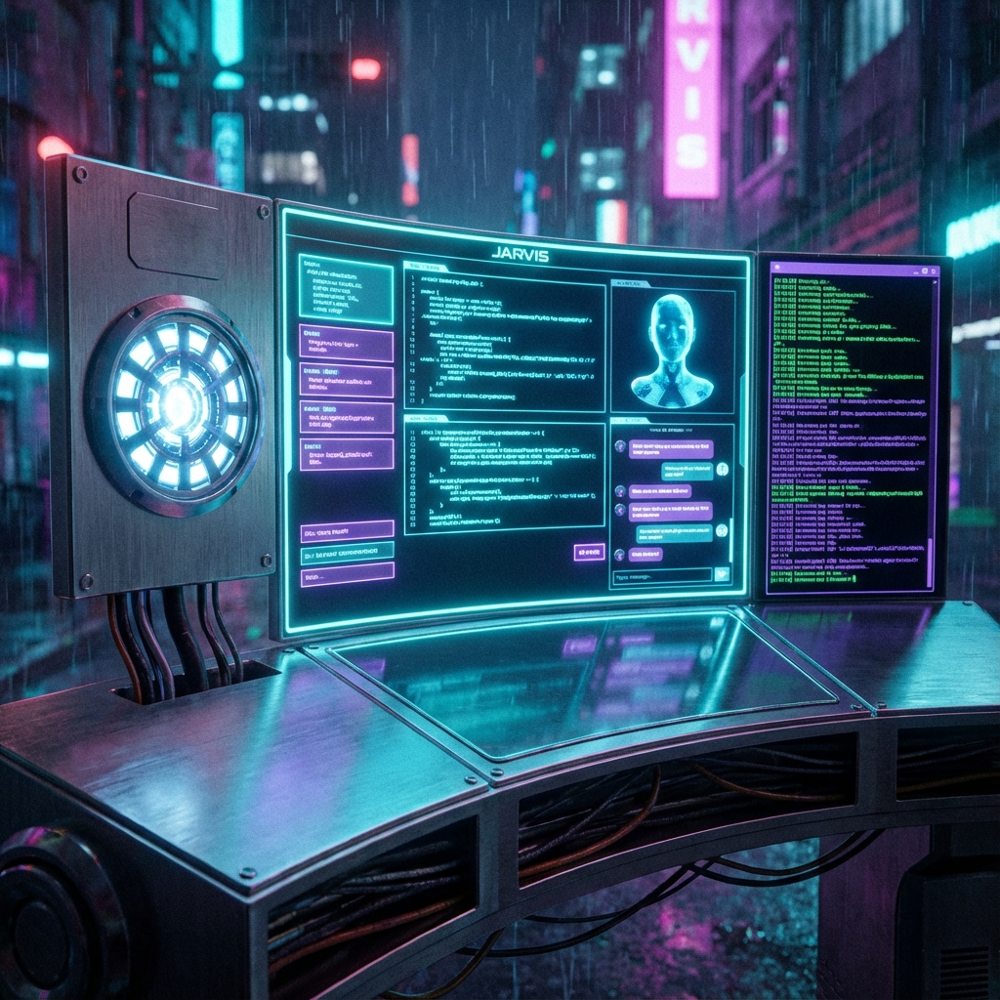
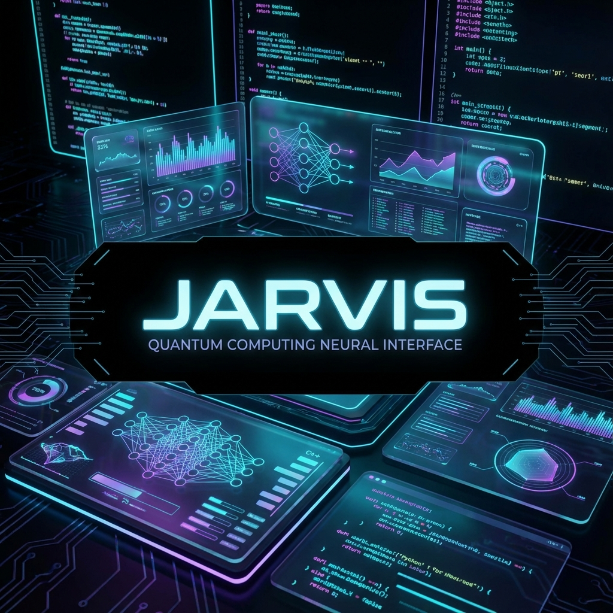

<div align="center">
  

  <h1>J.A.R.V.I.S</h1>
  <p>
    <strong>Neural Interface v2.5 // Cyberpunk Edition</strong>
  </p>

  <p>
    <a href="https://nextjs.org"></a>
    <a href="https://tailwindcss.com"></a>
    <a href="https://www.framer.com/motion/"></a>
    <a href="https://ui.shadcn.com"></a>
    <a href="https://aistudio.google.com/"></a>
  </p>

  <br />

  <p align="center">
    <strong>"I am JARVIS. How may I assist you?"</strong>
    <br />
    A production-grade, autonomous AI Agent built for the future.
  </p>
</div>

<br />

## 🌌 Overview

**JARVIS** is not just a chatbot; it's a fully realized **AI Command Center**. Redesigned with a jaw-dropping **Cyberpunk/Holographic Interface**, it combines the raw power of **Google Gemini 2.5** with the fluidity of **Framer Motion**.

The interface is built to feel "alive" — with breathing neon glows, scanning data streams, and a reactive AI core that visualizes the agent's thinking process in real-time.

---

## ✨ Key Features

### 🧠 **Advanced AI Core**
- **Engine**: Powered by Google's latest `gemini-2.5-flash` model.
- **Capabilities**: Real-time reasoning, code generation, and complex problem solving.
- **Visualizer**: An "Arc Reactor" style core that changes states (Idle / Thinking / Speaking / Error).

### 🎨 **Stunning UI/UX**
- **Tech**: Built with **Framer Motion** for 60fps cinematic animations.
- **Style**: Custom "Glassmorphism" design capability similar to Material 3 but with a futuristic twist.
- **Components**:
    - **HoloCards**: Floating glass panels with scanline interference effects.
    - **Live Terminal**: A rolling log of the agent's internal thought process.
    - **Cyber Chat**: Code blocks that look like they belong in a sci-fi hacker terminal.

### ⚡ **Production Ready**
- **Stack**: Next.js 15 (App Router), TypeScript, Tailwind CSS.
- **Streaming**: Instant token-by-token responses using Vercel AI SDK patterns.
- **Robust**: Full error handling for API quotas and network issues.

---

## 🛠️ Technology Stack

| Component | Technology | Description |
| :--- | :--- | :--- |
| **Framework** | **Next.js 15** | App Router, Server Actions, React Server Components. |
| **Styling** | **Tailwind CSS** | Utility-first styling with custom "Neon" presets. |
| **Animation** | **Framer Motion** | Complex layout transitions and physics-based motion. |
| **Components** | **ShadCN UI** | Accessible, headless UI primitives (Radix). |
| **AI Model** | **Google Gemini** | Multimodal generative AI model (v2.5). |

---

## 🚀 Getting Started

### Prerequisites
- Node.js 18+
- Google Gemini API Key

### Installation

1.  **Clone the Repository**
    ```bash
    git clone https://github.com/kirtan597/J-A-R-V-I-S.git
    cd J-A-R-V-I-S
    ```

2.  **Install Packages**
    ```bash
    npm install
    ```

3.  **Configure Environment**
    Create a `.env` file in the root directory:
    ```bash
    GEMINI_API_KEY=your_dummy_key_here
    ```

4.  **Run the System**
    ```bash
    npm run dev
    ```
    Open `http://localhost:3000` to initialize the neural link.

---

## 📸 Interface Preview

<div align="center">
  
  
</div>

---

## 🤝 Contributing

Contributions are welcome! Please feel free to submit a Pull Request.

1.  Fork the Project
2.  Create your Feature Branch (`git checkout -b feature/AmazingFeature`)
3.  Commit your Changes (`git commit -m 'Add some AmazingFeature'`)
4.  Push to the Branch (`git push origin feature/AmazingFeature`)
5.  Open a Pull Request

---

**Built with ❤️ for the Future.**
